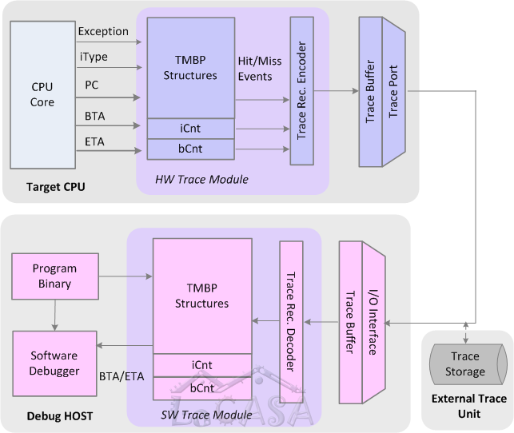

Ideally, firmware and software developers of embedded systems would like to be able to answer the simple question 
“What is my system doing?” at any point in the development cycle. 
However, achieving complete visibility of all signals in real time in modern embedded systems is not feasible 
due to limited I/O bandwidth, high internal complexity, and high operating frequencies. 
Software developers face additional challenges caused by growing software complexity and 
ever tightening time-to-market pressures. 
According to an estimate, software developers spend 50%-75% of their development time in program debugging, 
yet the nation still loses approximately US$ 20-60 billion a year due to software bugs and glitches.

Traditional approaches to debugging and testing of embedded processors using 
a JTAG port are not sufficient to meet these challenges. 
With JTAG we have two basic functions: stopping the processor at any instruction or data access, 
and examining the system state or changing it from outside. 
The problem with this approach is that it is obtrusive – 
the order of events during debugging may deviate from the order of events during “native” program execution 
when no interference from debugging operations is present. 
These deviations can cause the original problem to disappear in the debug run. 
Moreover, stepping through the program is time-consuming for programmers and 
is simply not an option for real-time embedded systems. 
For instance, setting a breakpoint may be impossible or harmful in real-time systems 
such as a hard drive or vehicle engine controller. 
A number of even more challenging issues arise in multi-core systems. 
They may have multiple clock and power domains, 
and we must be able to support debugging of each core, 
regardless of what the other cores are doing. 
Debugging through a JTAG port is not well suited to meet these challenges. 
To meet these challenges and get reliable and high-performance products on the market on time, 
software developers increasingly rely upon on-chip resources for debugging and tracing.

The existing commercially available trace modules 
rely either on hefty on-chip buffers to store execution traces of sufficiently large program segments 
or on wide trace ports that can sustain a large amount of trace data in real-time. 
However, large trace buffers and/or wide trace ports significantly increase the system’s complexity and cost. 
In addition, the size of the trace buffers and the number of trace port pins cannot keep pace 
with the exponential growth in the number of on-chip logic gates – 
which is a substantial problem in the era of multicore systems.

These costs and scalability issues often make system-on-a-chip designers 
reluctant to invest additional chip area for debugging and tracing.
Compressing program execution traces at runtime in hardware can reduce the requirements 
for on-chip trace buffers and trace port communication bandwidth. 
Our research focuses on developing cost-effective compression algorithms and hardware structures 
that can support unobtrusive program tracing in real-time. 
We have introduced several highly effective mechanisms for capturing, filtering, and compression 
of instruction and data address traces and data value traces. 
Our mechanisms exploit program characteristics such as instruction and data temporal and spatial locality, 
new hardware structures (e.g., stream caches and stream predictors), and 
sophisticated software debugger to dramatically reduce the trace size 
sufficient for faithful reconstruction of program executions.

We have introduced several mechanisms for compression of program execution traces, 
such as compression based on stream descriptor cache and predictor, 
double move-to-front method, and compression based on branch predictors in the trace module. 
Our best compression algorithm achieves over 28-fold improvement over the commercial state-of-the-art, 
and requires only 0.036 bits per instruction of bandwidth at the trace port at the cost of only 5,200 additional gates. 
Our techniques for filtering of data values achieve compression ratios between 5 and 20 times. 
These excellent results confirm that investing in debugging infrastructure and 
specifically in trace compression algorithms can indeed enable unobtrusive program tracing in real-time, 
which in turn promise better software that runs faster and more reliable, and 
requires less time to be developed and tested. 
We continue our efforts to explore hardware support for debugging in multi-core embedded systems.

Relevant publications:
* mTrace - capturing and filtering/compressing hardware traces in multicores:   
\[[ACM.TECS'19](https://doi.org/10.1145/3322642)\] - tracing of data reads in multicores   
\[[IEEE.ICCD'16](../publications/files/mpam_iccd16.pdf)\] 
\[[ACM.CASES'16](../publications/files/05_3_Milenkovic_CASES16.pdf)\]   
\[[Elsevier.JSA'15](http://www.sciencedirect.com/science/article/pii/S1383762115000752)\] -
mcfTRaptor: tracing of control-flow in multicores   

* sTrace - capturing and filtering/compressing hardware traces in single cores:   
\[[IEEE.TC'10](../publications/files/milenkovic_TC10.pdf)\] 
\[[ACM.CASES'10b](../publications/files/vuam_cases10b.pdf)\] 
\[[ACM.CASES'10a](../publications/files/vuam_cases10a.pdf)\]    
\[[IEEE.ICCD'09](../publications/files/am_iccd09.pdf)\] 
\[[ACM.DAC'09](../publications/files/vuam_dac09.pdf)\] 
\[[IEEE.DCC'07](../publications/files/milenkovic_dcc07.pdf)\]   

   

_Acknowledgment: This work was supported in part by US National Science
Foundation (NSF) grant CNS-1217470._