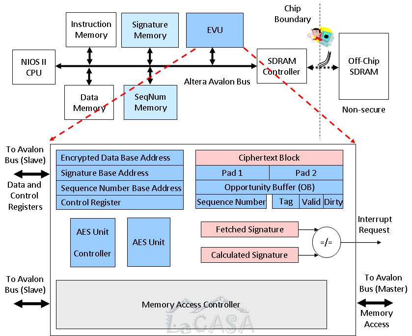

Modern society relies on embedded systems to perform an increasing multitude of tasks: 
they are indispensable to modern communication devices, medical equipment, consumer electronics, 
home appliances, transportation systems, and even weapons systems. 
As the number of embedded applications increases, 
so do the incentives for attackers to compromise the security of these systems. 
Security breaches in these systems may have wide ranging impacts, 
from simple loss of revenue to loss of life. 
Maintaining security in embedded systems is therefore vital for the consumer, industry, and government.  
  
Computer systems are often subject to software attacks typically launched across the network 
by exploiting known software vulnerabilities. 
According to the United States Computer Emergency Readiness Team, 
8,064 software vulnerabilities were identified in the year 2006 alone; the number of actual attacks was much greater. 
These vulnerabilities affect not only personal computers, but also a growing number of portable and mobile computing platforms. 
Unauthorized copying of software is another major threat. 
The Business Software Alliance estimates that, in the year 2006, 35% of all software installed on personal computers was pirated, 
leading to forty billion dollars in lost revenue. 
Moreover, embedded systems operating in hostile environments are often subjected to physical attacks. 
Here adversaries tamper with the memory, buses, and I/O devices in order to extract critical secrets, 
reverse-engineer the design, or take control of the system. 
Attackers may also employ side-channel attacks, using indirect analysis to reverse-engineer a system.  
  
Our research focuses on secure processor architectures that will ensure code and data integrity and confidentiality 
with minimal design and operating costs. 
An embedded system with a proposed secure processor configured to operate in a secure mode 
allows execution of trusted programs only (code integrity). 
These programs accept and process only trusted data (data integrity). 
Any unauthorized change of either programs or data will be detected. 
We thus protect against software attacks and physical attacks, such as spoofing, splicing, and replay. 
In addition, both programs and data can be encrypted, providing privacy (code and data confidentiality).  
  
Integrity is ensured using runtime verification of 
cryptographically sound signatures embedded in the code and data. 
Data blocks are further protected from replay attacks by using sequence numbers. 
The sequence numbers themselves are protected using a tree-like structure. 
Confidentiality is ensured by encrypting code and data using a variant one-time pad (OTP) scheme. 
To counter performance overheads induced by signature fetching and verification latencies, 
the proposed architecture incorporates the following architectural enhancements: 
parallelizable signatures, conditional execution of unverified instructions, and caching of sequence numbers. 
Memory overhead due to embedded signatures is reduced by protecting multiple instruction and/or data blocks with a single signature.

Selected Publications: \[[ERSA'09](../publications/files/ajram_ersa09.pdf)\] \[[MICPRO'09](../publications/files/ajram_micpro09.pdf)\] \[[ICCD'07](../publications/files/ajrmmam_iccd07.pdf)\]

