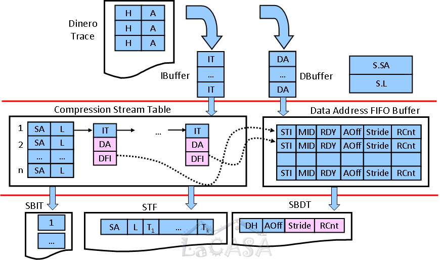

To offer a faithful representation of a specific workload, traces must be very large, 
encompassing billions and trillions of memory references and instructions. 
For example, a SPEC benchmark may execute more than a trillion of instructions for a single reference input set. 
This translates into over 10 terabytes of disk storage for a program trace, 
assuming a 10 byte trace record for each executed instruction. 
In conditions where a typical workload includes several dozens of benchmarks, each with multiple input sets, 
the total trace size becomes a critical issue.

To efficiently store, transfer, and use traces, 
they must be compressed as much as possible. 
Although traditional compression techniques offer good compression ratios, 
even further reduction of traces is needed. 
We investigate new methods for software trace compression that exploit inherent characteristics of 
instruction and data traces such as basic blocks, streams, and spatial and temporal locality. 
We have introduced several highly effective trace compression techniques for instruction and data address traces, 
such as N-tuple compression and Stream-Based Trace compression (SBC). 
For example, SBC reduces the size of SPEC CPU2000 Dinero instruction and data address traces from 18 to 309 times, 
outperforming the best trace compression techniques presented in the open literature.
SBC can successfully be  combined with general-purpose compression techniques.
The combined SBC-gzip compression ratio is from 80 to 35,595, and the SBC-bzip2 compression ratio is from 75 to 191,257.
Moreover, the results of our evaluation show that SBC outperforms other trace compression techniques 
when both decompression time and compression time are considered.

Selected publications: \[[TOMACS'07](../publications/files/milenkovic_tomacs07.pdf)\] \[[WWC'03](../publications/files/milenkovic_wwc03.pdf)\] \[[CAL'03](../publications/files/milenkovic_cal03.pdf)\] \[[PDCS'03](../publications/files/milenkovic_pdcs03.pdf)\]

Software for Stream-Based Trace Compression and SPEC CPU2000 Traces are available
[here](http://lacasa.uah.edu/index.php/software-data/stream-based-trace-compression).

