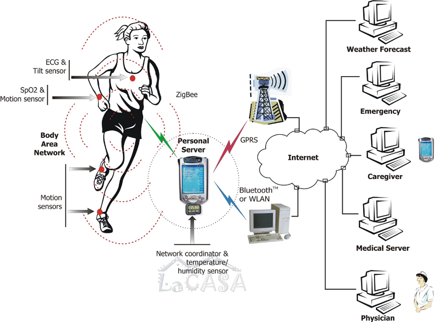

Recent technological advances in sensors, low-power microelectronics and miniaturization, 
and wireless networking enabled the design and proliferation of wireless sensor networks 
capable of autonomously monitoring and controlling environments. 
One of the most promising applications of sensor networks is for human health monitoring. 
A number of tiny wireless sensors, strategically placed on the human body, 
create a wireless body area network that can monitor various vital signs, 
providing real-time feedback to the user and medical personnel. 
The wireless body area networks promise to revolutionize healthcare services and 
address the imminent crisis in healthcare systems due to current demographic and economic trends.  
In collaboration with Dr. Emil Jovanov, we pioneered the concept of wireless body area networks (WBANs) 
and designed one of the first academic prototypes (see below). 
We have been working on a number of projects related to wireless body area networks since 2003. 
These projects span across multiple system layers, including hardware development of wireless sensors, 
software development for sensor nodes (sampling, processing, communication); 
network protocols and optimization; security in WBANs; 
software development for PDAs/smartphones and personal computers; 
higher-level data integration and representation; and system support for healthcare services.  
We have developed several generations of research prototypes and continue to seek 
for new techniques that will further improve reliability, functionality, and 
cost-effectiveness of these systems, as well as user compliance and comfort. 
Example projects are development of algorithms for step detection on accelerometer-based motion sensors 
(extremely resource-constrained systems), development algorithms for assessment of user's activity using a minimum subset of motion sensors, and 
development of algorithms for on-sensor real-time detection of arrhythmias. 
We are always looking for smart individuals that are ready to give their best ideas and skills in shaping this emerging field.

Selected articles:
*   WBAN Systems and Applications:  \[[JNER'05](../publications/files/ejam_jner05.pdf)\]
*   WBAN System Architecture: \[[COMPCOMM'06](../publications/files/milenkovic_compcomm06.pdf)\] \[[JMM'06](../publications/files/coamej_jmm06.pdf)\]
*   Sensors, Hardware, Processing: \[[ACM.SE'05](../publications/files/otto-acmse05.pdf)\] \[[IEEE.EMBS'05b](../publications/files/ejam_embs05b.pdf)\] \[[IEEE.EMBS'04](../publications/files/ejam_embs04.pdf)\]
*   Time Synchronization: \[[IEEE.SSST'05a](../publications/files/dc_ssst05_synch.pdf)\]
*   Security and Interoperability: \[[IEEE.EMSB'05a](../publications/files/milenkovic_ssst05rtp.pdf)\]
*   Power Measurements & Optimizations: \[[IEEE.SSST'b](../publications/files/milenkovic_ssst05rtp.pdf)\]

The first figure below illustrates our concept of wireless body area networks for health monitoring and appeared in our paper 
"[A Wireless Body Area Network of Intelligent Motion Sensors for Computer Assisted Physical Rehabilitation](http://www.jneuroengrehab.com/content/2/1/6)," 
published in the [Journal of NeuroEngineering and Rehabilitation](http://www.jneuroengrehab.com/home/). 
This paper was among the most read papers in this journal of all time ([Click here for the rankings](http://www.jneuroengrehab.com/mostviewedalltime)). 
The paper "[Wireless sensor networks for personal health monitoring: Issues and an
implementation](../publications/files/milenkovic_compcomm06.pdf)" 
published in Computer Communication journal discusses system issues and opportunities. 
It was consistently ranked among top 25 articles in Computer Communications journal. 
The figure in the middle shows signals collected on our early prototype from an ECG sensor and 
an accelerometer-based motion sensor; the signals are augmented  with events (detected on sensors) and 
corresponding TinyOS messages (it was me walking with the ECG sensor and a motion sensor on my knee). The last picture shows our early prototype from 2004. 

  
  
