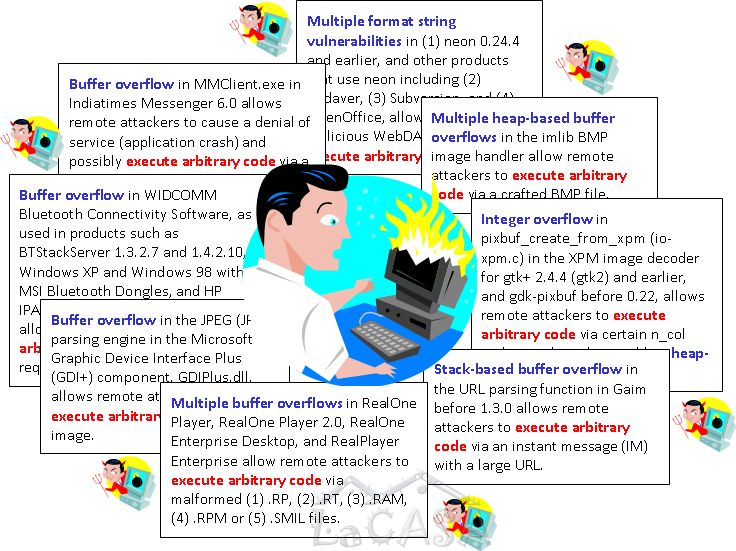
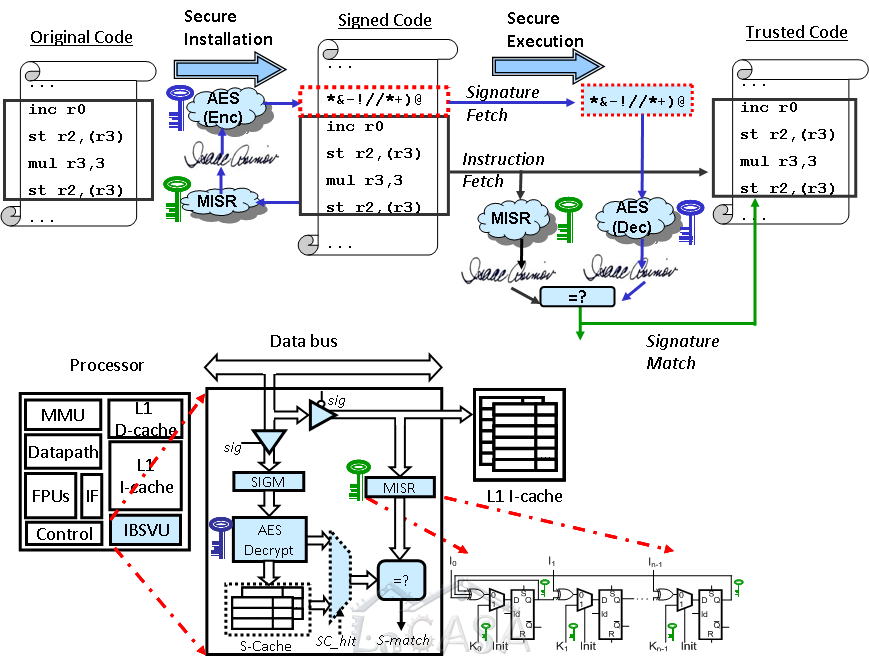

Current economic and technology trends result in an increased reliance of modern society on 
highly interconnected and deeply embedded computing systems. 
These trends underscore the utmost importance of computer system security. 
Failing to resist system faults and malicious software attacks can incur significant direct costs, 
as well as costs in lost revenue opportunities. 
This problem can be addressed at different levels, from more secure software and operating systems, 
down to solutions based on hardware support. 
The majority of the existing techniques tackle the problem of security flaws at the software level, 
lacking generality, often inducing prohibitive overhead in performance and cost, and generating a significant number of false alarms. 
On the other hand, the ever-increasing number of transistors on a chip allows us 
to look beyond performance improvements to increased system resilience to attacks. 
With more complex software having potentially a larger number of defects, 
increased number of attacks, and proliferation of networked computing platforms, 
we believe that dedicated processor resources should be used to ensure trusted program execution.  
  
Our research focuses at new hardware mechanisms to ensure software integrity. 
As a result of this effort, we have proposed a novel architecture that relies on hardware-supported run-time verification 
of software using encrypted instruction block signatures. 
We have proposed several implementations suitable for various computing platforms (server, desktop, and embedded); 
these implementations promise to counter malicious software attacks at minimal performance and power overhead with minimal additional on-chip area. 
The proposed implementations differ in the type of protected instruction blocks, 
placement of instruction block signatures in address space and physical memory, and signature handling after verification. 
Several of these implementations have proved to have very low performance overhead and are applicable to both embedded and high-end processors.

  

Relevant publications: \[[IOS.JEC'06](../publications/files/milenkovic_jec06.pdf)\] \[[ACM.CAN'05](../publications/files/milenkovic_can05.pdf)\] \[[ACM.CASES'05](../publications/files/milenkovic_cases05.pdf)\] \[[ACM.SE'04](../publications/files/milenkovic_acmse04f.pdf)\]

