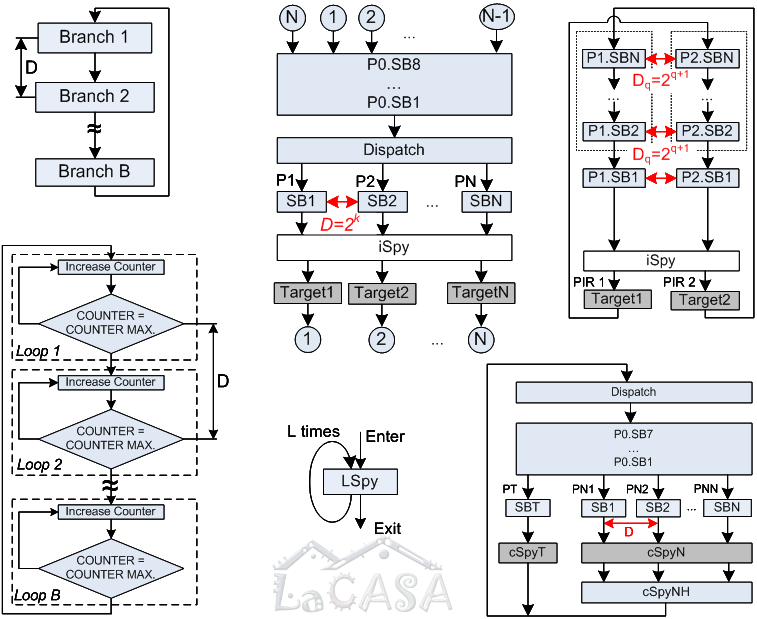
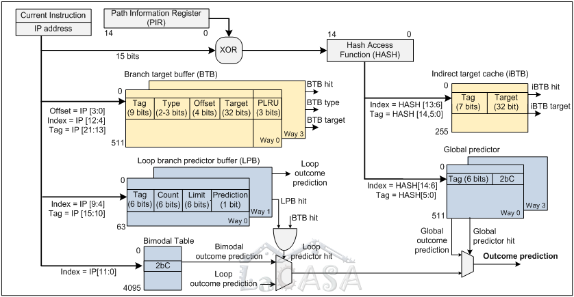

In order to achieve optimum performance of a given application on a given computer platform, 
compilers must keep up with new processor features, such as extended instruction set, 
pipelining, multiple-level cache hierarchy, instruction level parallelism, and branch prediction, exploiting new optimization possibilities. 
Although compilers for new processors do include some advanced optimization features they are specifically told by program developers 
for which architecture to optimize, by using different compiler switches or using CPUID.  
  
We believe that future compilers must be even more aware of the underlying architecture. 
However, internal architectural details are seldom made public. 
We proposed an experiment flow with a series of microbenchmarks that determine the organization and size of a branch predictor 
using on-chip performance monitoring registers. 
Such knowledge can be used either for manual code optimization, or for design of new, 
more architecture-aware compilers. 
It could also be used for verification of architectural simulators. 
Microbenchmarks for determining branch predictor organization are originally presented in our 
[WDDD'02 paper](../publications/files/milenkovic_WDDD02.pdf). 
The proposed experiment flow is illustrated with microbenchmarks tuned for Intel Pentium III and Pentium 4 processors. 
More information can be found in our paper published in [Software Practice &
Experience](../publications/files/am_spe04.pdf); 
the microbenchmarks are available [here](http://lacasa.uah.edu/index.php/software-data/microbenchmarks-for-determining-branch-predictor-organization).  
  
More recently, we developed a more elaborate experiment flows and corresponding microbenchmarks 
for determining organization of cache-like branch target and outcome predictor structures, 
indexed by branch address or program path information. 
The experiment flows are demonstrated on the Intel Pentium M branch predictor. 
We have been able to determine the size, organization, internal operation, and 
interactions between various hardware structures used in the Pentium M branch predictor, 
namely the branch target buffer, indirect branch target buffer, loop branch predictor buffer, 
global predictor, and bimodal predictor. 
These findings have been validated using a functional PIN model. 
The details can be found in our [ISPASS'09](../publications/files/vuam_ispass09.pdf) paper.

Selected publications: \[[ISPASS'09](../publications/files/vuam_ispass09.pdf)\]
\[[SPE'04](../publications/files/am_spe04.pdf)\]
\[[WDDD'02](../publications/files/milenkovic_WDDD02.pdf)\]

