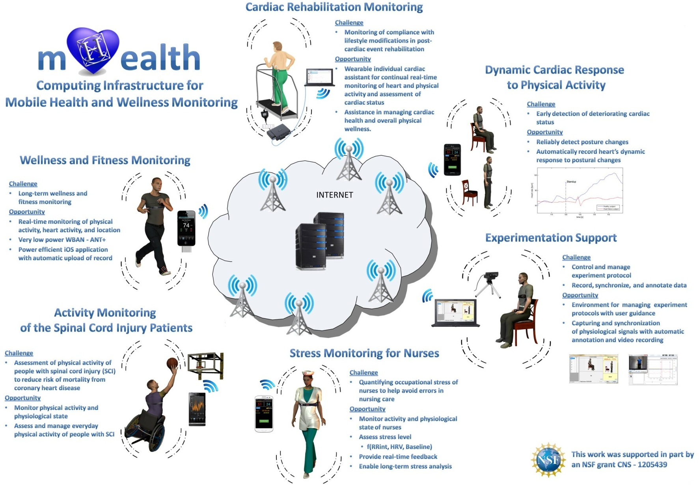

Healthcare systems are facing the imminent crisis caused by current economic, social, and demographic trends. 
According to the U.S. Census Bureau, the total healthcare expenditures reached
US $2.5 trillion in 2009 and are projected to reach 20 percent of the nation’s GDP in 2020. 
These statistics suggest that healthcare needs a shift toward more scalable and affordable solutions. 
Focus on proactive managing of wellness, prevention and an early detection of diseases, and 
optimal maintenance of chronic conditions has potential to reduce healthcare costs and increase quality of life. 
Recent technological advances in sensors, microelectronics integration and miniaturization, 
low-power electronics, wireless networking, mobile computing, and cloud computing allow us to modernize and 
change the way health care services are deployed and delivered.  
   
Mobile health monitoring systems that integrate wireless body area networks (WBANs) 
with a range of intelligent and miniature sensors, personal devices like smartphones, and 
servers that can be accessed over the Internet emerge as a promising technology for real-time, 
unobtrusive health and wellness monitoring of individuals during their normal daily activities. 
Unprecedented proliferation of personal computing devices and smart sensors makes such solutions practical and affordable. 
Further research is needed to explore design space and create optimal solution for a given application, 
understand full scale of opportunities offered by this technology, and address its technical challenges.    
   
This project aims to create mHealth, a new computing infrastructure to support research and education 
in the area of computer systems for mobile health and wellness monitoring at the University of Alabama in Huntsville. 
The mHealth infrastructure consists of: 
(a) a variety of wearable wireless sensors for monitoring users’ 
physiological signals, body movement and activity levels, and environmental conditions; 
(b) personal devices that collect data from the sensors, analyze them, 
compile personalized health status information, and upload data over the Internet to a server; and 
(c) an mHealth server running databases and services for logging and analysis of health records from multiple users.  
   
The mHealth infrastructure supports the investigators to pursue the following research goals:

*   Exploring critical design issues in the next generation of wireless wearable body area networks 
for health monitoring including their functionality, reliability, and energy-efficiency;
*   Creating annotated public data repositories with vital signs and physical activity parameters 
during activities of daily living to promote further research in mobile health monitoring;
*   Building research prototypes and developing algorithms, firmware and software artifacts 
for various health monitoring applications, including, but not limited to:
    *   Monitoring and managing physical activity in people who use wheelchairs for mobility (mWheelness),
    *   Monitoring and managing ambulatory rehabilitation of people with coronary disease (imWell),
    *   Health status assessment of people with coronary disease or predisposition to coronary disease (imWell)
    *   Monitoring of the occupational stress of nurses, and
    *   Quantifying Timed-Up-and-Go test used to assess mobility and balance in elderly and people with Parkinson’s disease (sTUG).

We expect this project to provide the following benefits:
*   Improve our understanding of the design space of wearable ubiquitous platforms for health monitoring
*   Improve quality of life of people with disabilities
*   Promote healthy behaviors through use of technology in general population
*   Enable affordable solutions for ambulatory rehabilitation, and
*   Enable solutions for an early detection of health conditions.

Selected publications:
*   mHealth research infrastructure: \[[ACM.XRDS'13](https://doi.org/10.1145/2539269)\]
*   Mobility assessment: \[[MDPI.Information'16](http://www.mdpi.com/2078-2489/7/3/47/html)\] \[[IEEE.HealthCom'15a](../publications/files/aadam_HealthCom15_sbutton.pdf)\]    
*   mHealth data compression: \[[IEEE.HealthCom'15b](../publications/files/aadam_HealthCom15_compr.pdf)\] 
*   mWheelness: \[[IEEE.BSN'13a](../publications/files/bsn13a_mWheelness.pdf)\] 
*   sTUG: \[[IEEE.BSN'13b](../publications/files/bsn13b_sTUG.pdf)\] 
*   imWell: \[[IEEE.EMBC'13](../publications/files/embc13_imWell.pdf)\]

Visit [portal.mhealth.uah.edu](http://portal.mhealth.uah.edu) for more information.   
_Acknowledgment: This work was supported in part by US National Science
Foundation (NSF) grant CNS-1205439_.