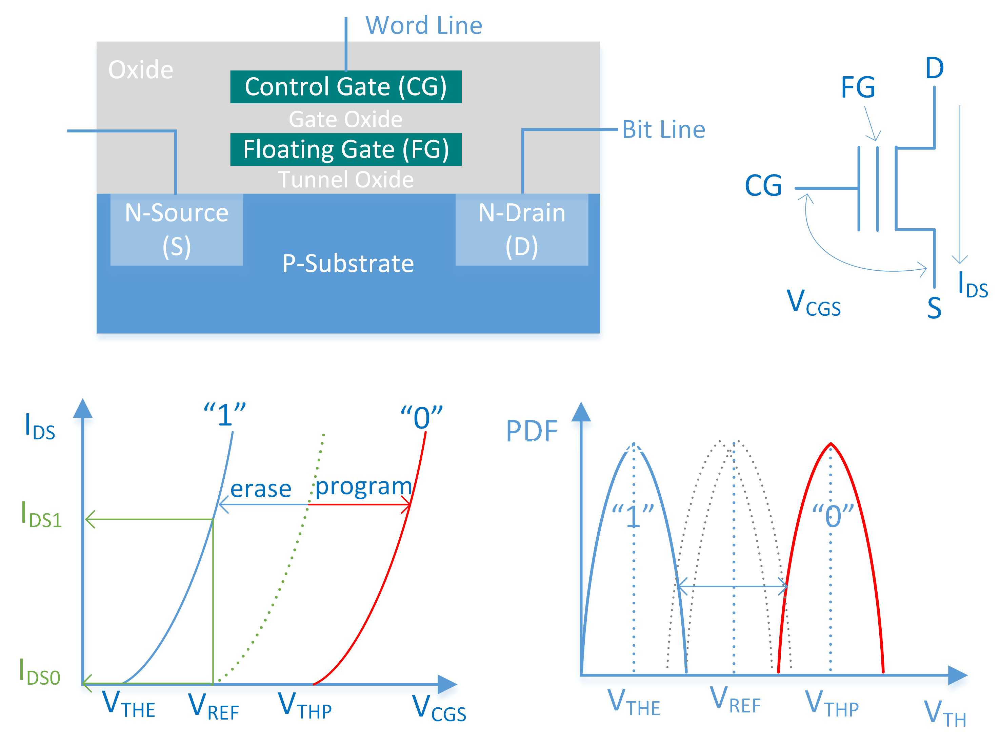

Non-volatile memory (NVM) is a semiconductor technology that allows computing devices 
to retain data and programs stored without a continuous power supply. 
NVMs are one of the fastest growing portions of semiconductor industry, 
driven by ever-increasing amounts of generated data - 
the amount of data created daily is forecast to reach 466 ZettaBytes (10^18 bytes) in 2025, 
an almost tenfold increase over 59 ZettaBytes created daily in 2020.
Different types of NVM chips have been introduced, from early EEPROM memories, 
via contemporary NAND and NOR flash memories, 
to emerging 3D XPoint, Ferroelectric RAM (FeRAM), Magnetoresistive RAM (MRAM), and Resistive RAM (RRAM).
They differ in their key characteristics, such as, capacity, form-factor, speed, 
interfaces, energy consumption, retention, endurance, and operating conditions. 
They also differ in cost and target applications. 
The most common types of NVMs are NOR flash memories used in embedded computer systems and IoT devices and 
NAND flash memories used as the basic building blocks of solid-state storage devices (SSDs), 
USB drives, memory cards, smartphones, automotive electronics, medical devices, and other devices. 
The emerging types of NVMs (FeRAM, MRAM RRAM) promise better retention, endurance, and speed, 
but they are currently lagging behind the established flash memories in cost and capacity. 

We pursue several projects focusing on state-of-the-art and emerging non-volatile memories 
in collaboration with Dr. Ray who leads the Hardware Reliability and Security Lab. 
A broad theme of these projects is finding new approaches to leverage physical properties of NVM chips 
to enrich their functionality or improve their operation. 
The projects focus on the development of: 
(a) new flash memory based functions to improve security and privacy of computing devices, 
(b) new techniques to reduce energy consumption of NVMs and thus improve overall energy-efficiency of computing devices, 
(c) new algorithms for data management in NVMs to improve data retention and endurance, and 
(d) new algorithms for data management in NVMs to ensure data integrity when operating in harsh environments (e.g., in presence of radiation).

These efforts resulted in new flash memory-based true random number generators 
\[[IEEE.TED'18](../publication/files/RayMilenkovic_TED18.pdf)\] \[[IEEE.TC'19](../publications/files/ppam_tc19.pdf)\], 
Physical-Unclonable Functions to prevent counterfeits \[[IEEE.TED'20a](https://ieeexplore.ieee.org/document/8993414)\], 
watermarking techniques to prevent counterfeits \[[ACM.DAC'20](../publications/files/ppbram_dac20.pdf)\] \[[IEEE.TED'20b](https://ieeexplore.ieee.org/document/9174844)\], 
and new energy-efficient memory operations in microcontrollers \[[IEEE.ISQED'20](../publications/files/ppam_isqed20.pdf)\].

